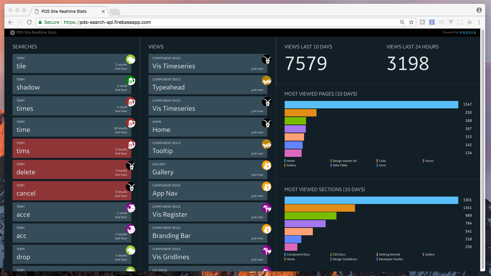

# Predix Design System Recorder/Dashboard

This repo hosts two codebases:

1. A set of Firebase functions that are used to collect user view and search events from the [Predix Design System](https://www.predix-ui.com) website
2. A [real-time dashboard](http://pds-search-api.firebaseapp.com/) that displays those metrics in real-time, hosted on the Firebase static web server



The code that observes user actions and generates API requests to the view/search function endpoints is in the [Predix UI website repo](https://github.com/predix-ui/predix-ui.github.io). A [snapshot of the code is here](https://github.com/predix-ui/predix-ui.github.io/blob/472549814fca31b38c52e2ece298332a1d5226bf/elements/px-catalog/px-catalog.html#L421-L504). It may have been moved somewhere else in the repo.

## Develop and deploy

### Install tools, clone project

To develop the functions or the dashboard, you'll need node and the firebase tools installed globally on your machine:

* Install [node](https://nodejs.org/en/download/). This includes npm -- the node package manager.
* Install [firebase-tools](https://github.com/firebase/firebase-tools) globally: `$ npm install -g firebase-tools`

To develop the dashboard, you'll also need bower and gulp:

* Install [bower](https://bower.io/) globally: `$ npm install -g bower`
* Install [gulp](http://gulpjs.com/) globally: `$ npm install -g gulp-cli`
* Install [polymer-cli](https://www.polymer-project.org/2.0/docs/tools/polymer-cli-commands) globally: `$npm install -g polymer-cli`
* Install [typescript](https://www.typescriptlang.org/index.html) globally: `$npm install -g typescript`

Clone the project to your machine and open the root in your shell of choice:

```
$ git clone https://github.com/predixdesignsystem/pds-search-api.git
$ cd pds-search-api
```

The functions and dashboard code are essentially two separate codebases sharing the same repo. Skip to the instructions for the one you want to work on to continue.

### Develop functions

Before getting started, you should take a look at the [Firebase Functions documentation](https://firebase.google.com/docs/functions/) and familiarize yourself with the basic concepts for Firebase functions. You don't need to read the whole thing, but you should be able to answer "What is a Firebase function?," "How do I write one?," and "How do I call one from my code?".

**Start developing:**

Open the `functions/` directory in your shell and install dependencies to start developing:

```
$ cd functions/
$ npm install
```

The source code for the functions is in `functions/index.js`. Open that file and make changes to it.

To preview your changes before committing and deploying, run the following:

```
$ firebase serve --only functions
```

The functions will be served from localhost. Open a tool like Postman, or your command line, to test things out. Read the Firebase docs for more information on serving functions locally.

**Deploy updates to Firebase:**

1. Once you've made your changes and tested them to ensure everything is working, commit the changes with git
2. Authenticate to your firebase account, which must have the right permissions to push to the pds-search-api app. Then deploy the changes:

```
$ firebase login
$ firebase deploy --only functions
```

### Develop dashboard

The dashboard code is a static website served through Firebase. It is built using Polymer 2.0 as a JavaScript framework. The code is written in TypeScript and compiled to JavaScript before it is checked in. It relies on [polymer-decorators](https://github.com/Polymer/polymer-decorators), which exposes decorators for writing Polymer 2.0 components. You should read up on the basics of [Typescript](https://www.typescriptlang.org/docs/handbook/typescript-in-5-minutes.html) and glance at [polymer-decorators](https://github.com/Polymer/polymer-decorators) before getting started. It is assumed you already have experience developing Polymer-based components and applications (if you don't, take a look at the [Polymer docs](https://www.polymer-project.org/)).


**Start developing:**

Open the `public/` directory in your shell and install dependencies to start developing:

```
$ cd public/
$ npm install
$ bower install
```

The HTML and JavaScript for the app is in `public/src/`, and the SCSS is in `public/sass`. Go ahead and start making changes.

Use the polymer-cli to serve the dashboard during development:

```
$ polymer serve
```

Run typescript in another shell tab/window to compile .ts files to .js as you make changes. Don't make changes to any .js files. Make changes to the .ts source files.

```
$ tsc --watch # re-builds on file changes
$ tsc # builds files once
```

Run gulp in another shell tab/window to compile .scss files to .css as you make changes:

```
$ gulp watch # rebuilds on file changes
$ gulp # builds files once
```

**Deploy updates to Firebase:**

1. Once you've made your changes and tested them to ensure everything is working, commit the changes with git
2. Authenticate to your firebase account, which must have the right permissions to push to the pds-search-api app. Then deploy the changes:

```
$ firebase login
$ firebase deploy --only hosting
```

## Support and further information

If you find any bugs, have issues with the code, or want to request enhancements, file a issue on this [Github repo](https://github.com/predixdesignsystem/pds-search-api).

## Copyright

Copyright &copy; 2018 GE Digital. All rights reserved.

The copyright to the computer software herein is the property of GE Digital. The software may be used and/or copied only with the written permission of GE Digital or in accordance with the terms and conditions stipulated in the agreement/contract under which the software has been supplied.
